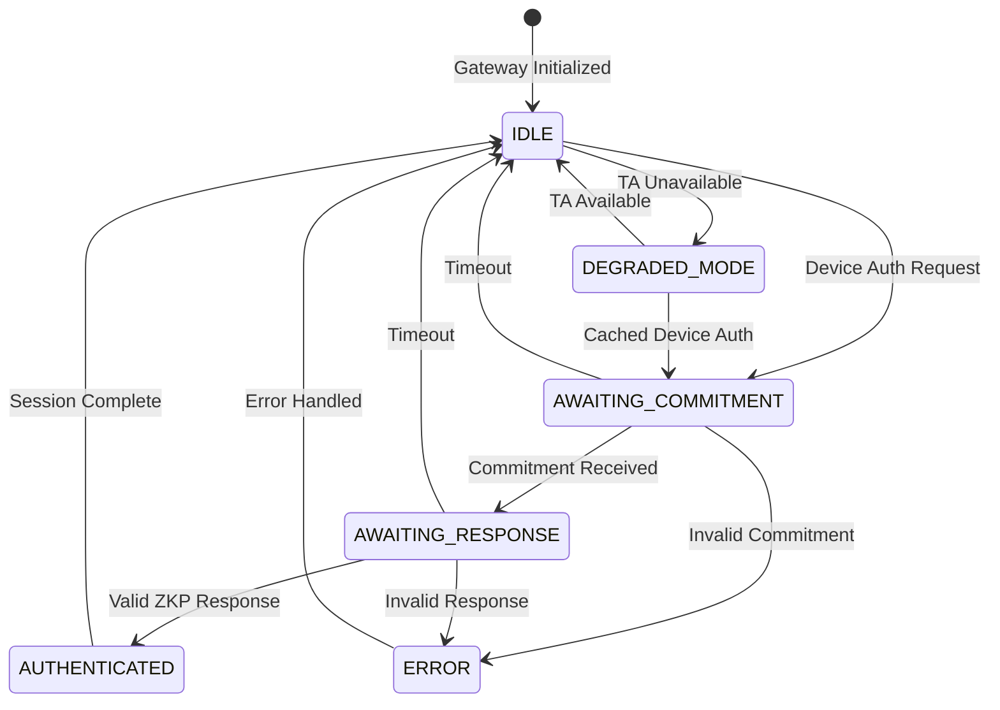
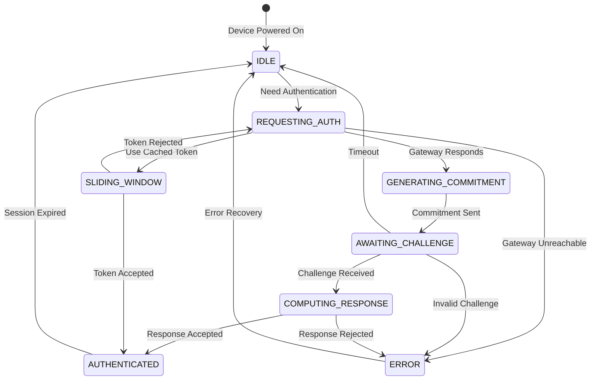
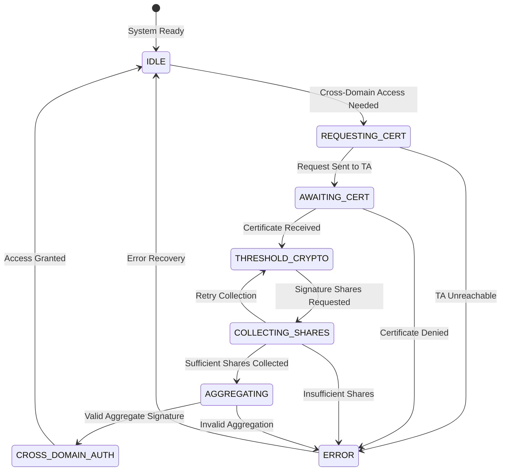

# ZKPAS Protocol State Machine

This document formally models the state machines for the Gateway Node and IoT Device components in the ZKPAS protocol.

## Gateway Node State Machine

### Gateway State Transitions

| Current State       | Event                  | Next State          | Conditions                      |
| ------------------- | ---------------------- | ------------------- | ------------------------------- |
| IDLE                | Authentication Request | AWAITING_COMMITMENT | TA Available, Device Registered |
| IDLE                | TA Unavailable         | DEGRADED_MODE       | TA unreachable                  |
| AWAITING_COMMITMENT | Commitment Received    | AWAITING_RESPONSE   | Valid commitment format         |
| AWAITING_COMMITMENT | Invalid Commitment     | ERROR               | Malformed or invalid commitment |
| AWAITING_COMMITMENT | Timeout                | IDLE                | No response within timeout      |
| AWAITING_RESPONSE   | Valid ZKP Response     | AUTHENTICATED       | ZKP verification successful     |
| AWAITING_RESPONSE   | Invalid Response       | ERROR               | ZKP verification failed         |
| AWAITING_RESPONSE   | Timeout                | IDLE                | No response within timeout      |
| AUTHENTICATED       | Session Complete       | IDLE                | Normal completion               |
| ERROR               | Error Handled          | IDLE                | Error logged and cleared        |
| DEGRADED_MODE       | TA Available           | IDLE                | TA becomes reachable            |
| DEGRADED_MODE       | Cached Device Auth     | AWAITING_COMMITMENT | Valid cache entry exists        |

## IoT Device State Machine

### Device State Transitions

| Current State         | Event               | Next State            | Conditions             |
| --------------------- | ------------------- | --------------------- | ---------------------- |
| IDLE                  | Need Authentication | REQUESTING_AUTH       | Service required       |
| REQUESTING_AUTH       | Gateway Responds    | GENERATING_COMMITMENT | Full auth required     |
| REQUESTING_AUTH       | Use Cached Token    | SLIDING_WINDOW        | Valid token available  |
| REQUESTING_AUTH       | Gateway Unreachable | ERROR                 | Network failure        |
| GENERATING_COMMITMENT | Commitment Sent     | AWAITING_CHALLENGE    | Commitment transmitted |
| AWAITING_CHALLENGE    | Challenge Received  | COMPUTING_RESPONSE    | Valid challenge format |
| AWAITING_CHALLENGE    | Invalid Challenge   | ERROR                 | Malformed challenge    |
| AWAITING_CHALLENGE    | Timeout             | IDLE                  | No challenge received  |
| COMPUTING_RESPONSE    | Response Accepted   | AUTHENTICATED         | ZKP verified           |
| COMPUTING_RESPONSE    | Response Rejected   | ERROR                 | ZKP failed             |
| SLIDING_WINDOW        | Token Accepted      | AUTHENTICATED         | Token validated        |
| SLIDING_WINDOW        | Token Rejected      | REQUESTING_AUTH       | Fallback to full auth  |
| AUTHENTICATED         | Session Expired     | IDLE                  | Normal expiration      |
| ERROR                 | Error Recovery      | IDLE                  | Error handled          |

## Cross-Domain Authentication State Machine

## State Machine Invariants

### Gateway Node Invariants

1. **Mutual Exclusion**: Gateway can only be in one state at a time
2. **Authentication Uniqueness**: Each authentication session has unique correlation ID
3. **Degraded Mode Safety**: In degraded mode, only cached devices can authenticate
4. **Session Cleanup**: All sessions must eventually transition to IDLE or ERROR
5. **Timeout Bounds**: All waiting states have maximum timeout periods

### IoT Device Invariants

1. **Single Session**: Device can only have one active authentication session
2. **Token Freshness**: Sliding window tokens must be within validity period
3. **Commitment Binding**: Each commitment is cryptographically bound to device identity
4. **Response Uniqueness**: ZKP response is unique per challenge
5. **Session Expiry**: Authenticated sessions have bounded lifetime

### Cross-Domain Invariants

1. **Certificate Validity**: Cross-domain certificates have expiration times
2. **Threshold Security**: Minimum number of signature shares required
3. **Trust Anchor Availability**: At least t+1 trust anchors must be available
4. **Signature Binding**: Aggregate signature bound to specific access request

## Error Handling Patterns

### Transient Errors

- Network timeouts → Retry with exponential backoff
- Temporary TA unavailability → Enter degraded mode
- Message loss → Retransmit with sequence numbers

### Permanent Errors

- Invalid cryptographic material → Log and reject
- Malicious behavior detection → Block and alert
- Protocol violations → Terminate session

### Recovery Mechanisms

- **Graceful Degradation**: Continue with reduced functionality
- **Circuit Breaker**: Prevent cascade failures
- **Audit Trail**: Maintain complete error logs
- **Fail-Safe Defaults**: Deny access when in doubt

## Implementation Notes

### State Persistence

- States are maintained in memory for simulation
- Real implementation would persist critical state to non-volatile storage
- Recovery procedures needed for power failures

### Concurrency Considerations

- Multiple authentication sessions can run concurrently
- Each session maintains independent state
- Shared resources (cache, tokens) require thread-safe access

### Performance Characteristics

- State transitions are lightweight operations
- Cryptographic operations are the main performance bottleneck
- Timeouts prevent indefinite resource consumption

### Security Properties

- **Confidentiality**: Session keys protect subsequent communications
- **Integrity**: All state transitions are authenticated
- **Availability**: Degraded mode maintains service during failures
- **Non-repudiation**: All state changes are logged with digital signatures
